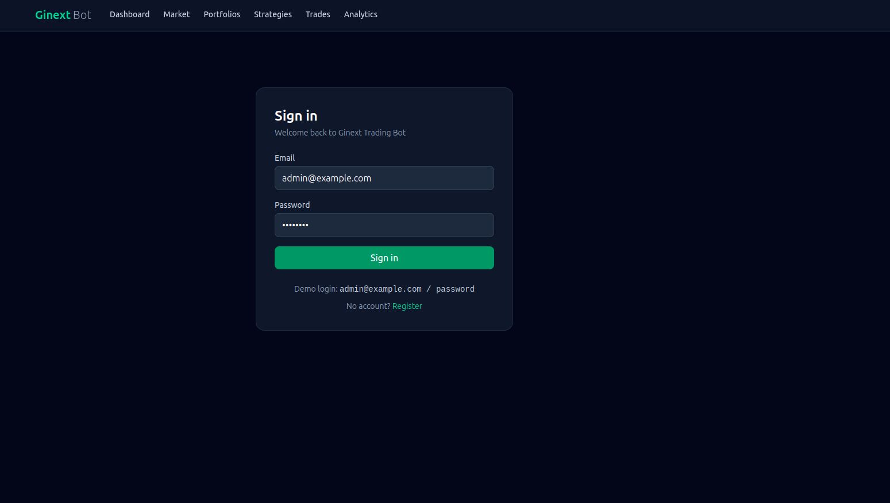
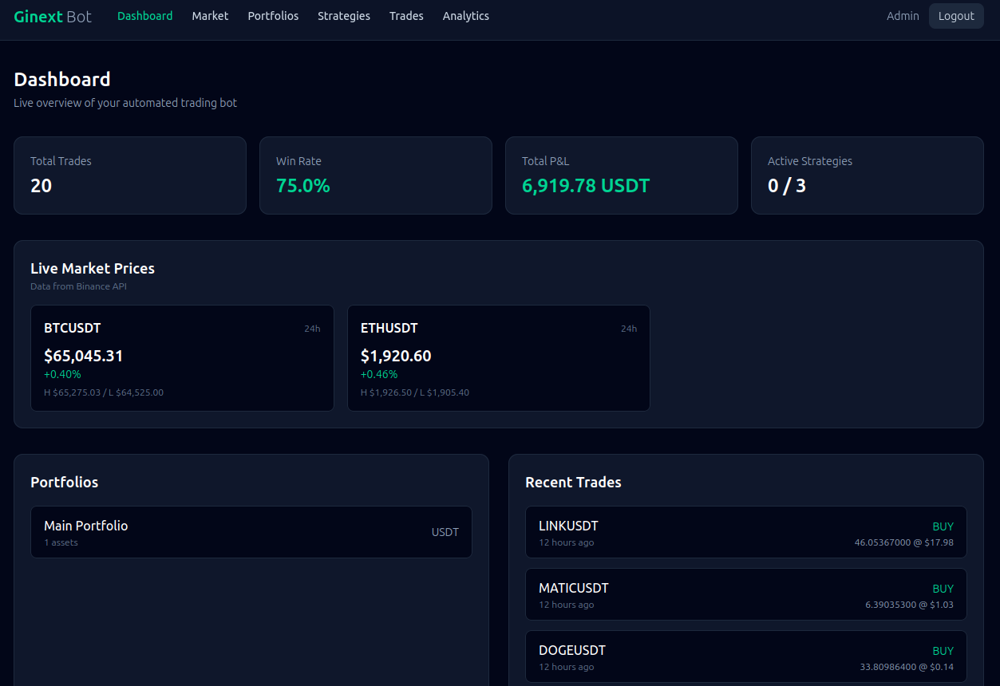
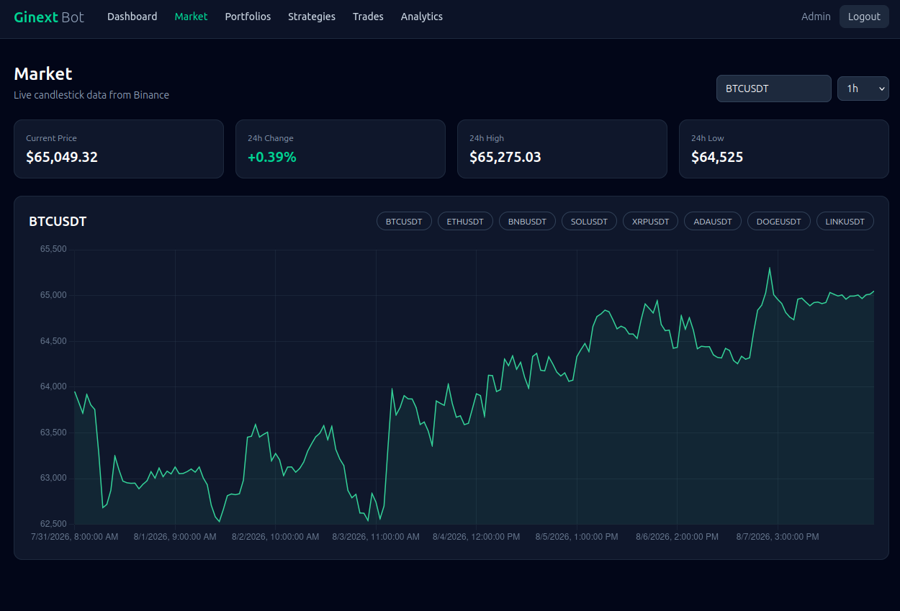
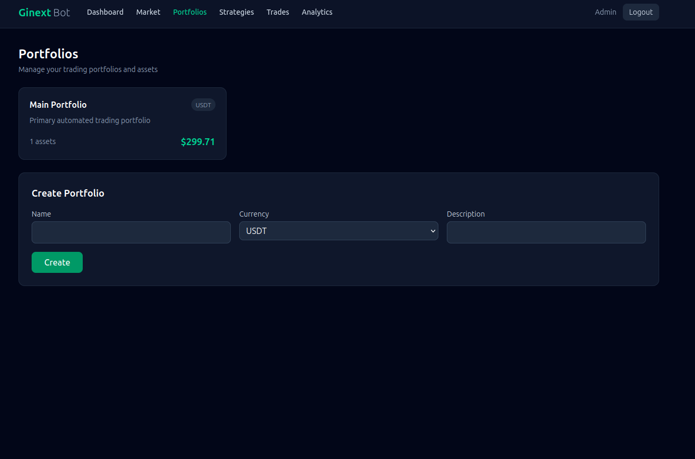
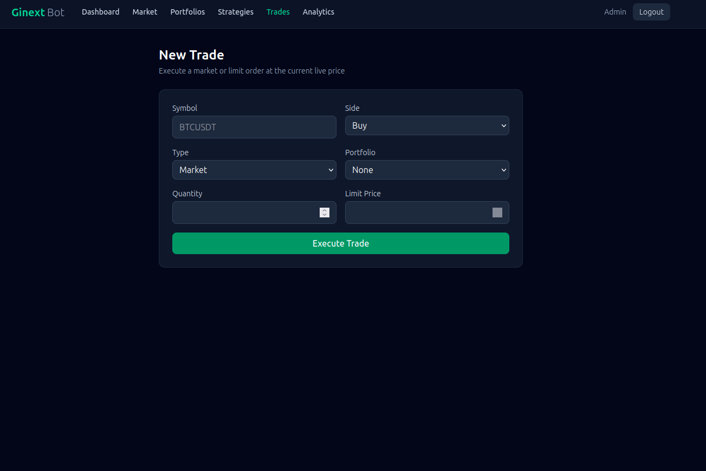
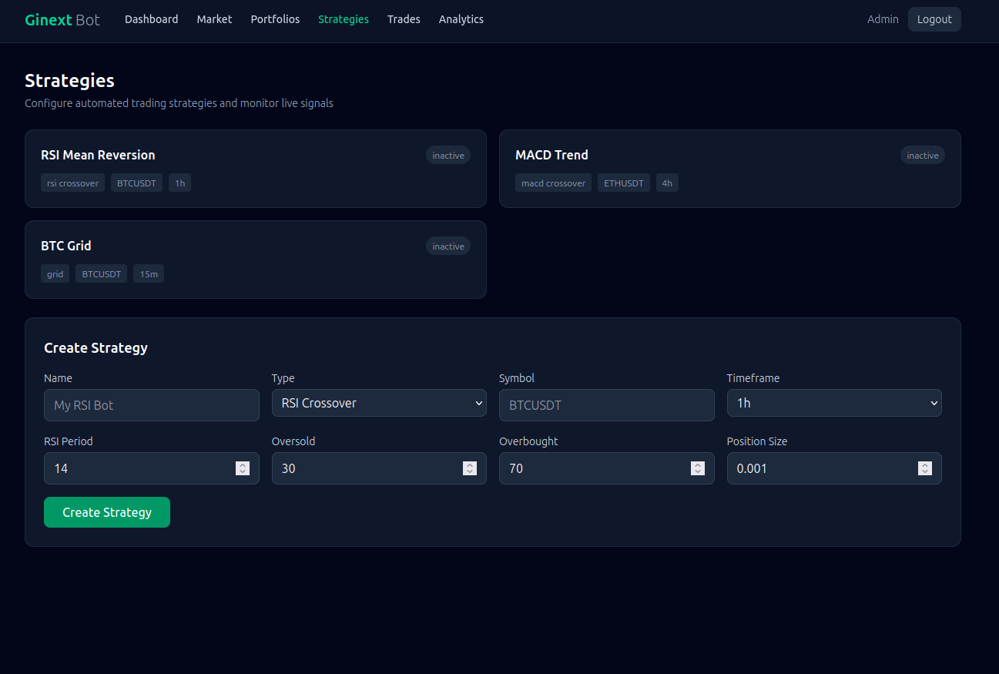
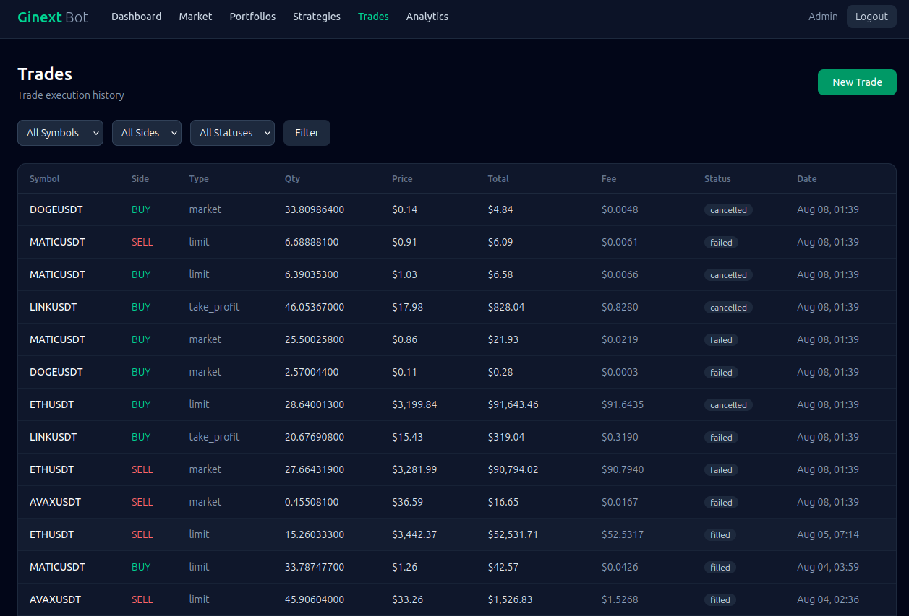
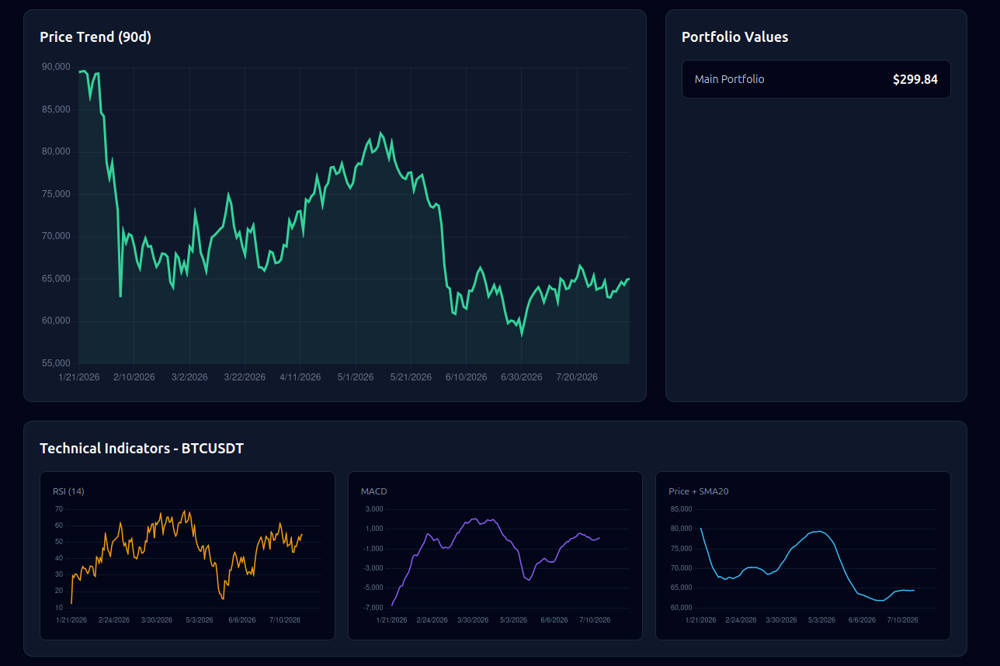

# Ginext Trading Bot

<p align="center">
  
  
  
  
  
  
  
  
</p>

Automated crypto trading bot, built for Binance automated trading with real-time market data, multiple strategies, portfolio management, risk controls, and analytics.

## Features

- **Real Binance data** — live prices, 24h tickers, and OHLCV klines from the Binance public API
- **Trading strategies** — RSI Crossover, MACD Crossover, Grid Trading, and DCA
- **Strategy engine** — evaluates live candles and emits buy/sell/hold signals
- **Portfolio management** — multi-asset holdings, live valuation, avg buy price tracking
- **Risk management** — max position size, daily loss limit, max open orders, exposure limits
- **Trade execution** — market/limit orders priced at real exchange rates, position auto-update
- **Analytics** — RSI, SMA, MACD, Bollinger Bands, win rate, P&L
- **Real-time dashboard** — live price charts (Chart.js + Alpine.js)
- **REST API** — Sanctum token auth, portfolios, strategies, trades, market, analytics
- **Scheduler** — `trading:update-prices` and `trading:check-stop-loss` commands

## Tech Stack

| Layer      | Technology                                                                |
| ---------- | ------------------------------------------------------------------------- |
| Backend    | Laravel 13, PHP 8.4                                                       |
| Frontend   | Blade, Alpine.js, Tailwind CSS 4, Chart.js, Vite                          |
| Database   | MySQL 8.0 + Redis 7                                                       |
| Auth       | Laravel Sanctum                                                           |
| Queue/Jobs | Redis-backed queue, scheduled jobs                                        |
| Docker     | Docker + Docker Compose (containers prefixed `trading_`, no auto-restart) |

## Docker Setup

Containers are prefixed `trading_` and use `restart: "no"`.

| Service     | Container            | Port            |
| ----------- | -------------------- | --------------- |
| Web (Nginx) | `trading_web`        | **8051**        |
| PHP-FPM     | `trading_app`        | 9000            |
| MySQL       | `trading_db`         | 3306 (internal) |
| Redis       | `trading_redis`      | 6379 (internal) |
| phpMyAdmin  | `trading_phpmyadmin` | **8052**        |

## Installation

```bash
docker compose up -d

docker compose exec -u appuser app php artisan migrate --seed
docker compose exec -u appuser app php artisan key:generate

# (first time only) build frontend assets
docker compose exec -u appuser app npm install
docker compose exec -u appuser app npm run build

# keep prices fresh
docker compose exec -u appuser app php artisan schedule:work
```

- App: **http://localhost:8051**
- phpMyAdmin: **http://localhost:8052** (root / root_secret)

### Demo login

```
admin@example.com / password
```

## Usage

- **Dashboard** — live market prices, portfolio value, recent trades
- **Market** — interactive price chart with symbol/interval switching
- **Portfolios** — add assets, track live value and average buy price
- **Strategies** — configure and activate bots; live signals shown
- **Trades** — place market/limit orders at real prices; risk checks applied
- **Analytics** — win rate, P&L, RSI/MACD/SMA/Bollinger indicators

## Screenshots

| | |
| --- | --- |
| **Login** |  |
| **Bot Dashboard** |  |
| **Market Trend** |  |
| **Portfolio Creation** |  |
| **New Trade** |  |
| **Strategies** |  |
| **Trade History** |  |
| **Analytics** |  |

### Manual commands

```bash
# Update prices + indicators for all active strategy symbols
docker compose exec -u appuser app php artisan trading:update-prices

# Evaluate pending stop losses
docker compose exec -u appuser app php artisan trading:check-stop-loss
```

## API (Sanctum)

```bash
TOKEN=$(curl -s -X POST http://localhost:8051/api/login \
  -H "Content-Type: application/json" \
  -d '{"email":"admin@example.com","password":"password"}' | jq -r .token)

curl -H "Authorization: Bearer $TOKEN" http://localhost:8051/api/portfolios
curl -H "Authorization: Bearer $TOKEN" http://localhost:8051/api/market/prices/BTCUSDT
```

Endpoints: `/api/login`, `/api/user`, `/api/portfolios`, `/api/strategies`, `/api/trades`, `/api/market/{prices,history,indicators,ticker}`, `/api/analytics/*`.

## Project Structure

```
app/
├── Http/Controllers/        # Web + Api controllers
├── Models/                  # Eloquent models
├── Services/
│   ├── Exchange/            # BinanceService (real API integration)
│   ├── Strategy/            # RSI, MACD, Grid, DCA + engine
│   ├── Trading/             # Order, Position, Risk services
│   ├── Analytics/           # Indicators, Performance
│   └── Market/              # PriceService
└── Jobs/                    # UpdatePrices, CalculateIndicators, ExecuteTrade, CheckStopLoss
```

## License

MIT
